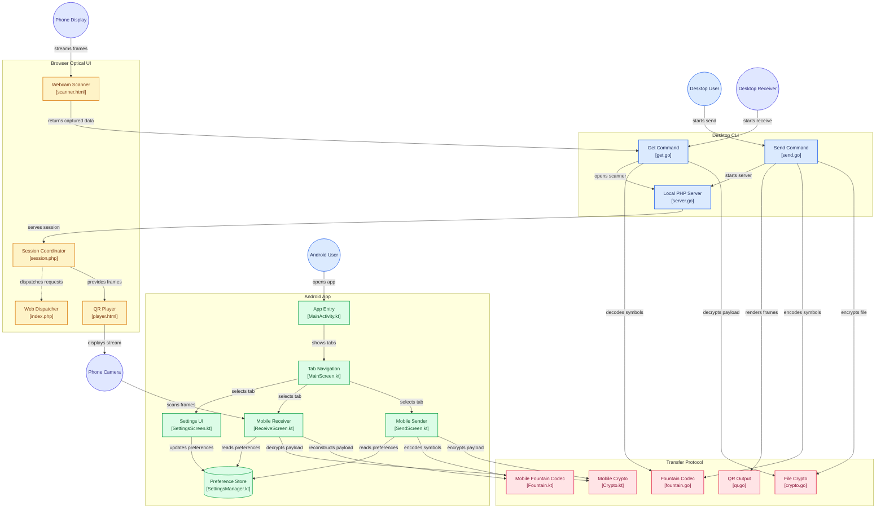

```mermaid
flowchart TD

subgraph group_desktop["Desktop CLI"]
  node_send_cmd["Send Command<br/>[send.go]"]
  node_get_cmd["Get Command<br/>[get.go]"]
  node_php_server["Local PHP Server<br/>[server.go]"]
end

subgraph group_web["Browser Optical UI"]
  node_session["Session Coordinator<br/>[session.php]"]
  node_player["QR Player<br/>[player.html]"]
  node_scanner["Webcam Scanner<br/>[scanner.html]"]
  node_index["Web Dispatcher<br/>[index.php]"]
end

subgraph group_android["Android App"]
  node_main_activity["App Entry<br/>[MainActivity.kt]"]
  node_main_screen["Tab Navigation<br/>[MainScreen.kt]"]
  node_send_screen["Mobile Sender<br/>[SendScreen.kt]"]
  node_receive_screen["Mobile Receiver<br/>[ReceiveScreen.kt]"]
  node_settings_screen["Settings UI<br/>[SettingsScreen.kt]"]
  node_settings[("Preference Store<br/>[SettingsManager.kt]")]
end

subgraph group_protocol["Transfer Protocol"]
  node_crypto_go["File Crypto<br/>[crypto.go]"]
  node_fountain_go["Fountain Codec<br/>[fountain.go]"]
  node_qr_go["QR Output<br/>[qr.go]"]
  node_crypto_android["Mobile Crypto<br/>[Crypto.kt]"]
  node_fountain_android["Mobile Fountain Codec<br/>[Fountain.kt]"]
end

node_desktop_user(("Desktop User"))
node_android_user(("Android User"))
node_receiver_pc(("Desktop Receiver"))
node_phone_camera(("Phone Camera"))
node_phone_display(("Phone Display"))

node_desktop_user -->|"starts send"| node_send_cmd
node_send_cmd -->|"encrypts file"| node_crypto_go
node_send_cmd -->|"encodes symbols"| node_fountain_go
node_send_cmd -->|"renders frames"| node_qr_go
node_send_cmd -->|"starts server"| node_php_server
node_php_server -->|"serves session"| node_session
node_session -->|"provides frames"| node_player
node_player -->|"displays stream"| node_phone_camera
node_phone_camera -->|"scans frames"| node_receive_screen
node_android_user -->|"opens app"| node_main_activity
node_main_activity -->|"shows tabs"| node_main_screen
node_main_screen -->|"selects tab"| node_send_screen
node_main_screen -->|"selects tab"| node_receive_screen
node_main_screen -->|"selects tab"| node_settings_screen
node_send_screen -->|"encrypts payload"| node_crypto_android
node_send_screen -->|"encodes symbols"| node_fountain_android
node_send_screen -->|"reads preferences"| node_settings
node_receive_screen -->|"reconstructs payload"| node_fountain_android
node_receive_screen -->|"decrypts payload"| node_crypto_android
node_receive_screen -->|"reads preferences"| node_settings
node_settings_screen -->|"updates preferences"| node_settings
node_phone_display -->|"streams frames"| node_scanner
node_scanner -->|"returns captured data"| node_get_cmd
node_receiver_pc -->|"starts receive"| node_get_cmd
node_get_cmd -->|"decrypts payload"| node_crypto_go
node_get_cmd -->|"decodes symbols"| node_fountain_go
node_get_cmd -->|"opens scanner"| node_php_server
node_session -.->|"dispatches requests"| node_index

click node_send_cmd "https://github.com/berlin-566/dove/blob/main/cli/cmd/send.go"
click node_get_cmd "https://github.com/berlin-566/dove/blob/main/cli/cmd/get.go"
click node_crypto_go "https://github.com/berlin-566/dove/blob/main/cli/pkg/crypto/crypto.go"
click node_fountain_go "https://github.com/berlin-566/dove/blob/main/cli/pkg/fountain/fountain.go"
click node_qr_go "https://github.com/berlin-566/dove/blob/main/cli/pkg/qr/qr.go"
click node_php_server "https://github.com/berlin-566/dove/blob/main/cli/pkg/server/server.go"
click node_session "https://github.com/berlin-566/dove/blob/main/web/session.php"
click node_player "https://github.com/berlin-566/dove/blob/main/web/player.html"
click node_scanner "https://github.com/berlin-566/dove/blob/main/web/scanner.html"
click node_index "https://github.com/berlin-566/dove/blob/main/web/index.php"
click node_main_activity "https://github.com/berlin-566/dove/blob/main/android/app/src/main/java/com/dove/app/MainActivity.kt"
click node_main_screen "https://github.com/berlin-566/dove/blob/main/android/app/src/main/java/com/dove/app/ui/screens/MainScreen.kt"
click node_send_screen "https://github.com/berlin-566/dove/blob/main/android/app/src/main/java/com/dove/app/ui/screens/SendScreen.kt"
click node_receive_screen "https://github.com/berlin-566/dove/blob/main/android/app/src/main/java/com/dove/app/ui/screens/ReceiveScreen.kt"
click node_settings_screen "https://github.com/berlin-566/dove/blob/main/android/app/src/main/java/com/dove/app/ui/screens/SettingsScreen.kt"
click node_settings "https://github.com/berlin-566/dove/blob/main/android/app/src/main/java/com/dove/app/settings/SettingsManager.kt"
click node_crypto_android "https://github.com/berlin-566/dove/blob/main/android/app/src/main/java/com/dove/app/crypto/Crypto.kt"
click node_fountain_android "https://github.com/berlin-566/dove/blob/main/android/app/src/main/java/com/dove/app/fountain/Fountain.kt"

classDef toneNeutral fill:#f8fafc,stroke:#334155,stroke-width:1.5px,color:#0f172a
classDef toneBlue fill:#dbeafe,stroke:#2563eb,stroke-width:1.5px,color:#172554
classDef toneAmber fill:#fef3c7,stroke:#d97706,stroke-width:1.5px,color:#78350f
classDef toneMint fill:#dcfce7,stroke:#16a34a,stroke-width:1.5px,color:#14532d
classDef toneRose fill:#ffe4e6,stroke:#e11d48,stroke-width:1.5px,color:#881337
classDef toneIndigo fill:#e0e7ff,stroke:#4f46e5,stroke-width:1.5px,color:#312e81
classDef toneTeal fill:#ccfbf1,stroke:#0f766e,stroke-width:1.5px,color:#134e4a
class node_send_cmd,node_get_cmd,node_php_server,node_desktop_user,node_android_user toneBlue
class node_session,node_player,node_scanner,node_index toneAmber
class node_main_activity,node_main_screen,node_send_screen,node_receive_screen,node_settings_screen,node_settings toneMint
class node_crypto_go,node_fountain_go,node_qr_go,node_crypto_android,node_fountain_android toneRose
class node_receiver_pc,node_phone_camera,node_phone_display toneIndigo

```
